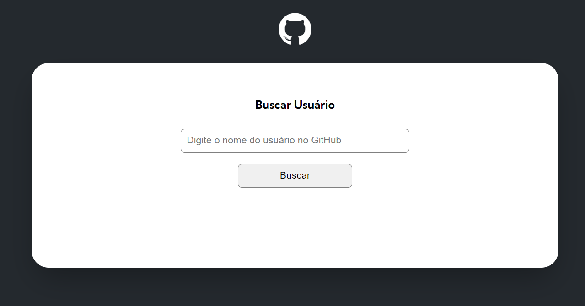

# CURSO DEV QUEST - APRENDA PROGRAMAÇÃO DO ZERO
## 3ª QUEST - JS AVANÇADO

### O que é uma QUEST?
Quests são desafios a serem feitos ao longo do curso para testar os conhecimentos, a terceira quest é referente a conclusão do módulo de JavaScript Avançado.

### Sobre essa QUEST
O desafio é inserir novas funcionalidades do projeto que foi trabalhado com a API do GitHub.

[Link do projeto]()

### Layout

### Tecnologias utilizadas
* [HTML](https://developer.mozilla.org/pt-BR/docs/Web/HTML)
* [CSS](https://developer.mozilla.org/pt-BR/docs/Web/CSS)
* [JavaScript](https://developer.mozilla.org/pt-BR/docs/Web/JavaScript)

### Autor
Eduardo Sousa

Entre em contato 👇
 

